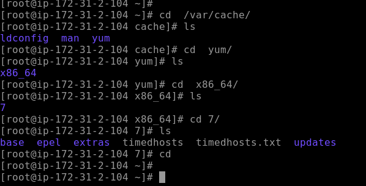
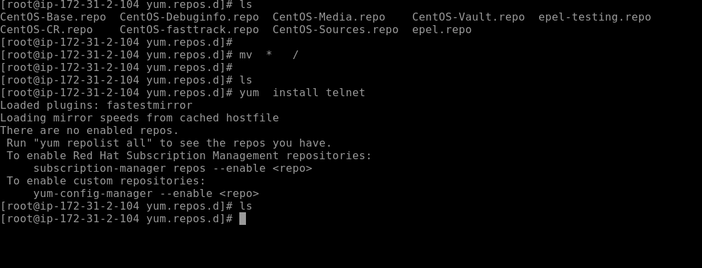
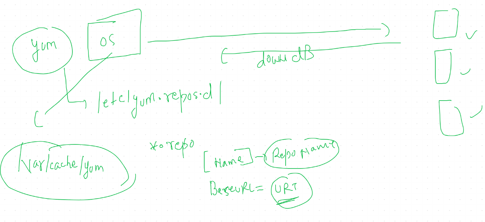
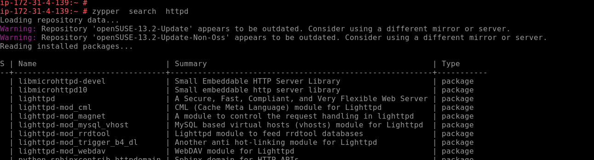
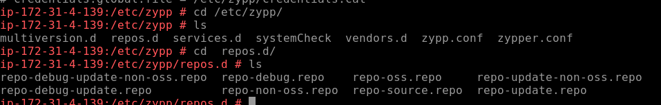
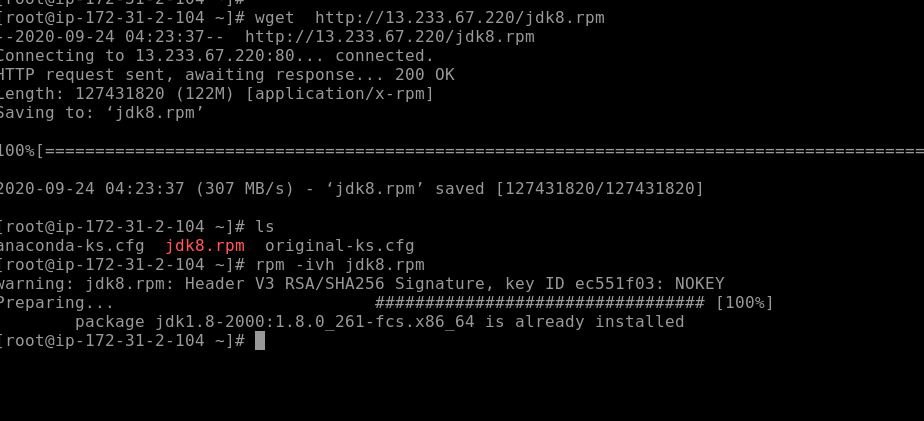
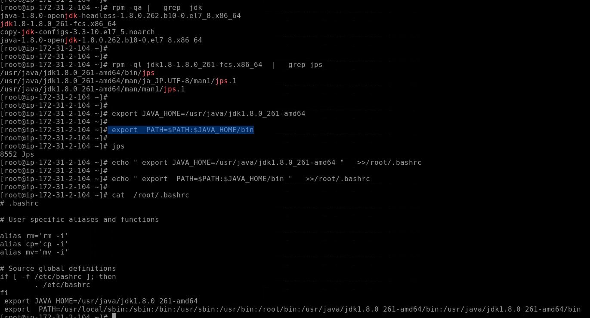

# YUM / zypper package management 

## yum info of cache

## common error in yum 

## some useful online repos for rpm / centos /rhel based flavour

[centos Mirror]('http://mirror.centos.org/')
--
[vault mirror]('http://vault.centos.org/')

## yum client server communication 

# OpenSuse package manager :- Zypper

## search pkg 

## zypper client configuration 

# JAVA installation with JDK 

## setting jdk path for jps

