# Storage in Linux 

##  Object and block discussion 

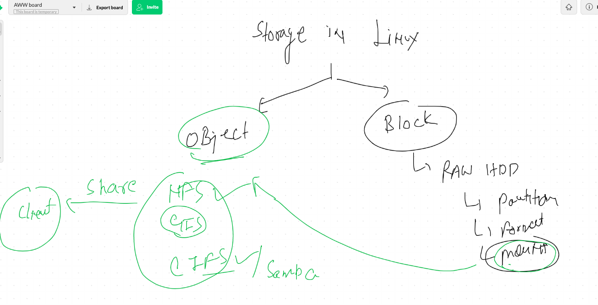

## Story of partition table

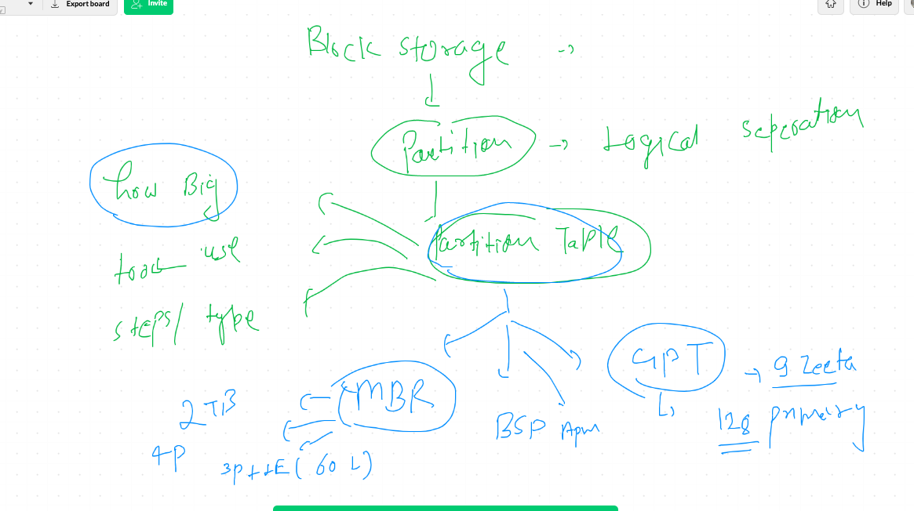

## steps to partition a new raw hdd

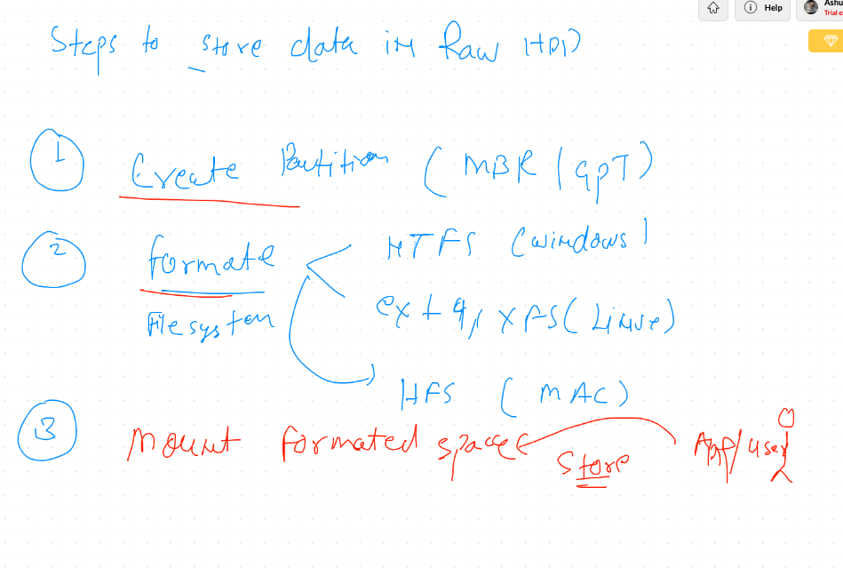

# creating partition using GPT

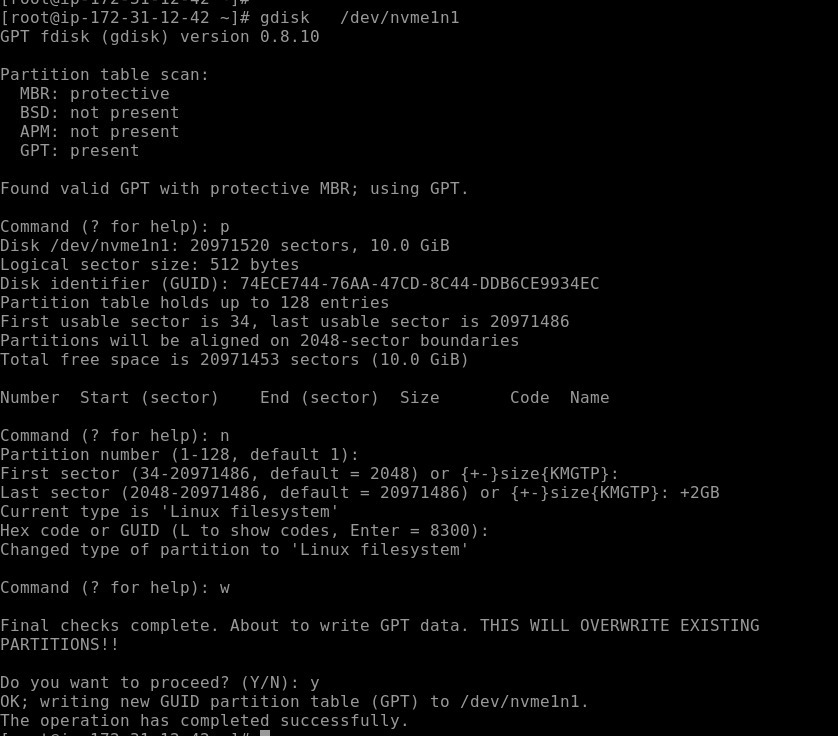

## format and mount

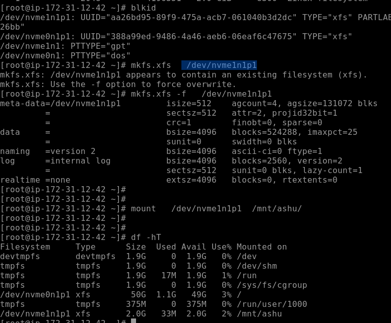

# Device Mapper

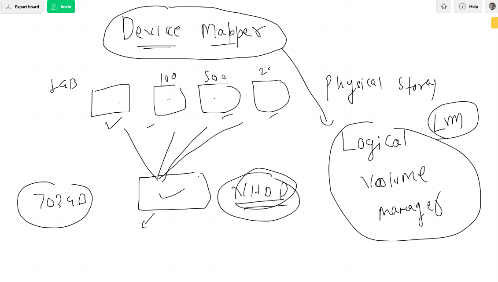

## LVM concept 

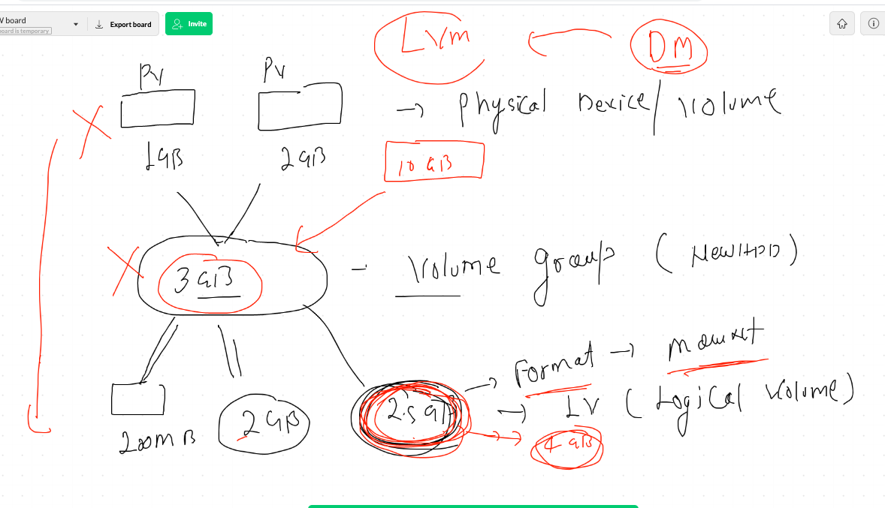

## creating Physical volume 

---
----

## pv create

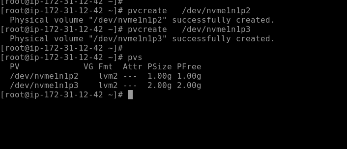

##  volume group create 

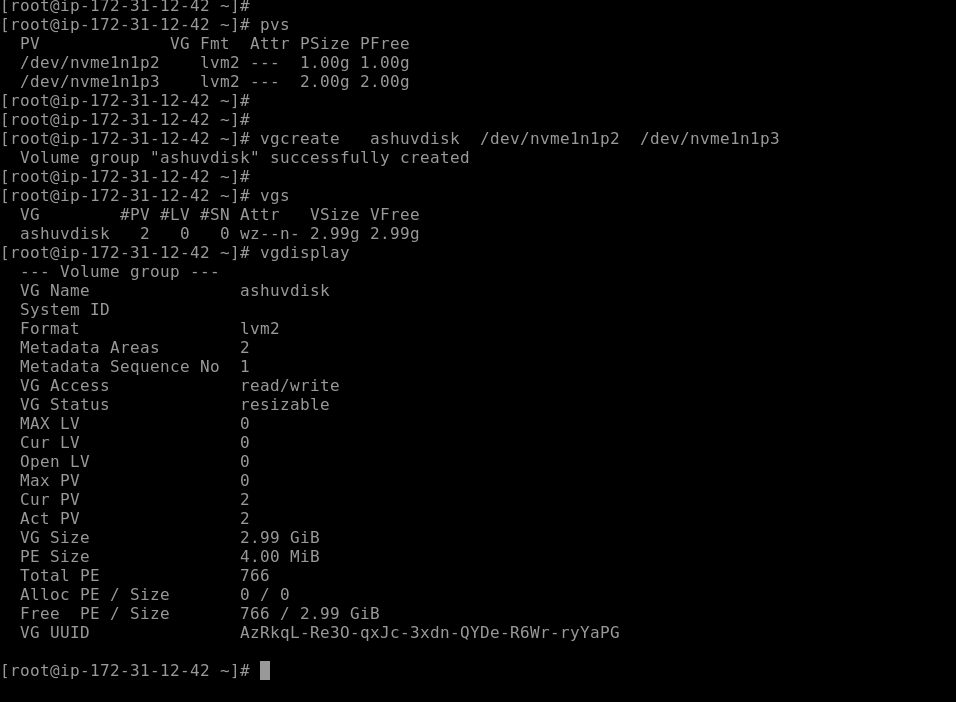

## creating logical volume from volume group

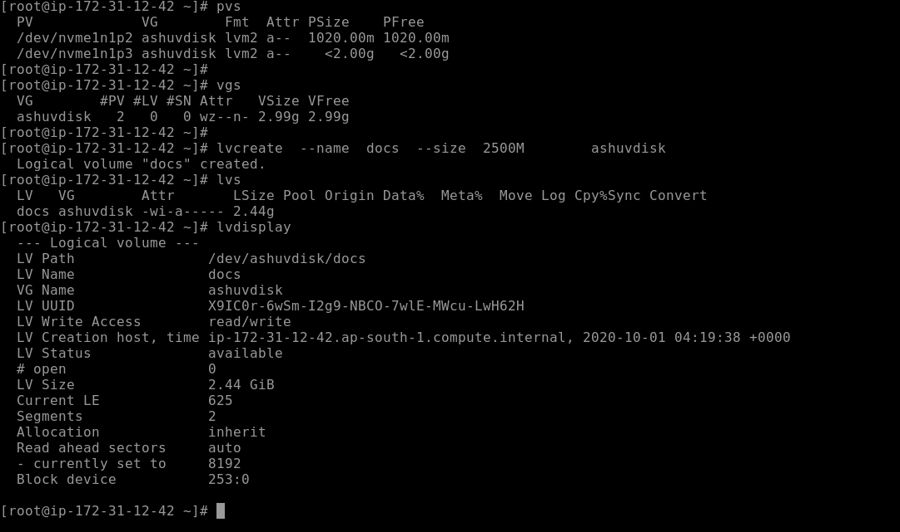

##  formating and mounting 

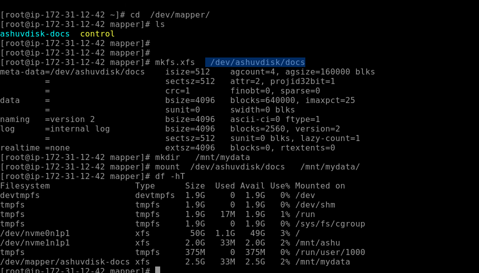

