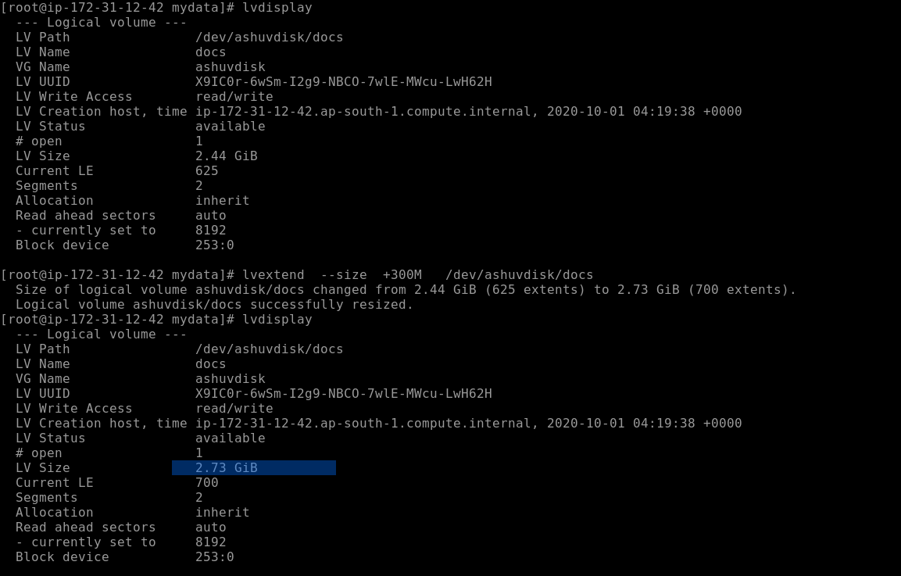
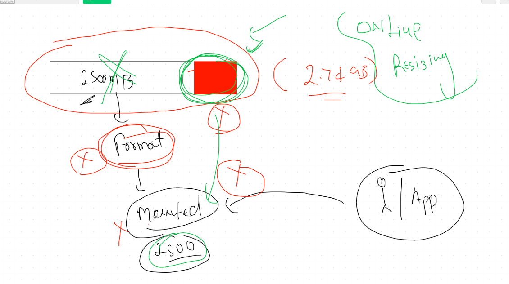
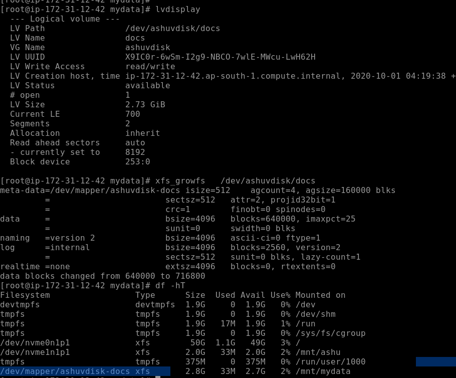
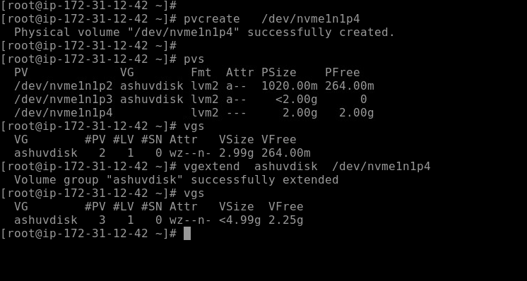
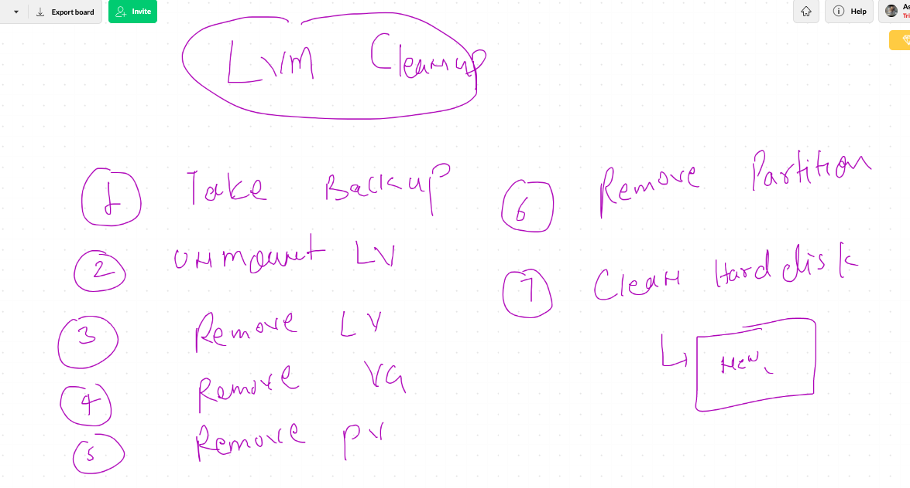
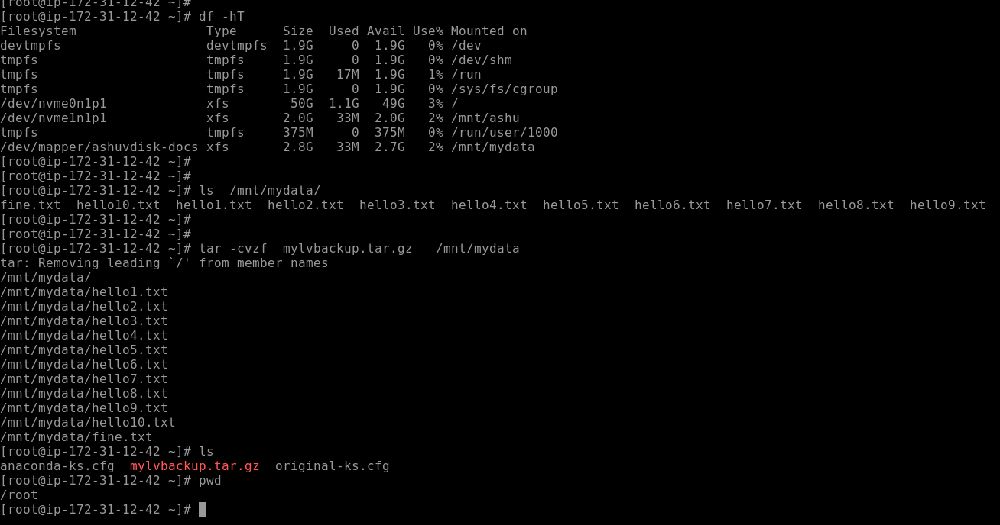
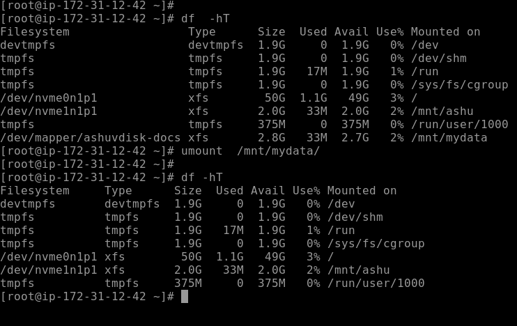
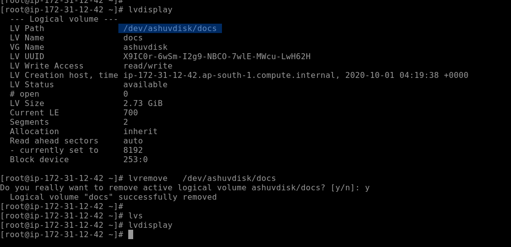
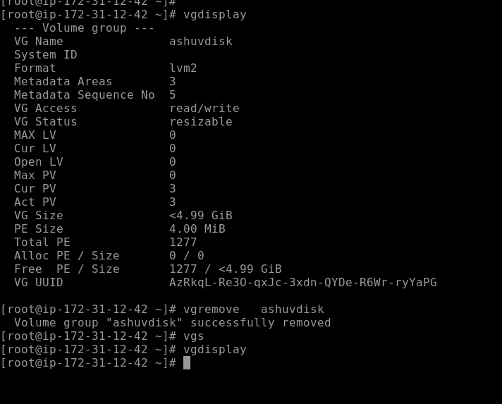

# Storage in Linux 

##  Object and block discussion 


## Story of partition table


## steps to partition a new raw hdd


# creating partition using GPT


## format and mount


# Device Mapper


## LVM concept 


## creating Physical volume 


---
----

## pv create


##  volume group create 


## creating logical volume from volume group


##  formating and mounting 


## LVM extending 



## lvm resizing 



----

## if XFS is the existing filesystem then 



## in case of EXt,2,3,4

```
resize2fs  path of LV 

```

## Extending volume group




# LVM and  hard disk clean process 

## Inshort we can revert usable disk to RAW disk 

## process of lvm remove




# Step of clean up lvm type hard disk 

## Step 1 : take backup of data 



## step 2 : unmount lvm 



## step 3 : lvremove



## step 4: remove vg 



## step 5 : remove pv


