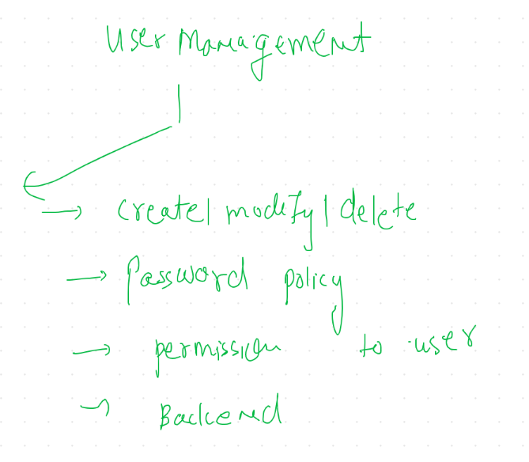
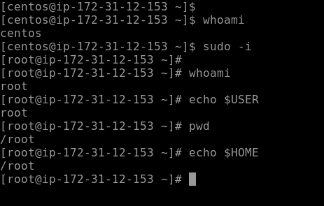
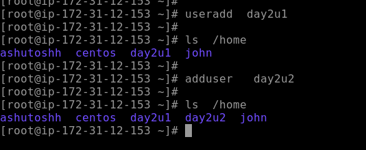
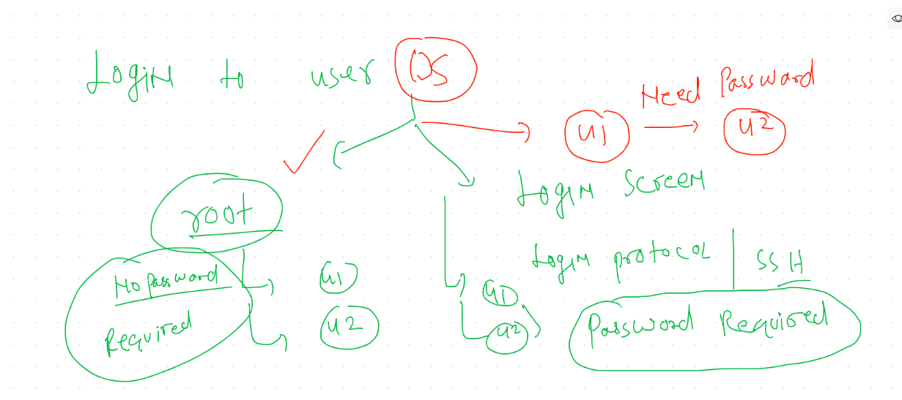
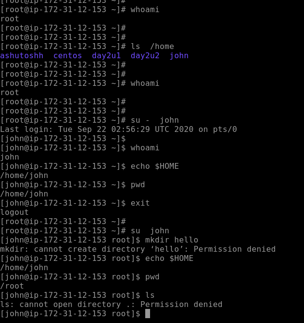
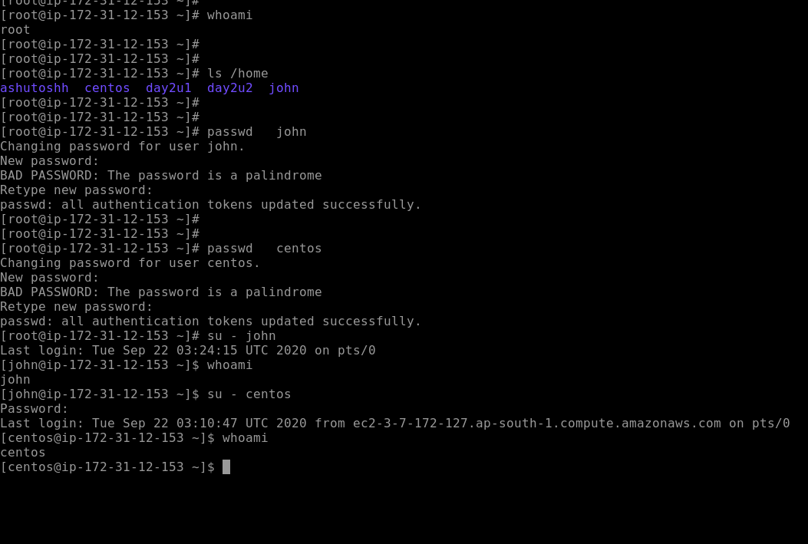
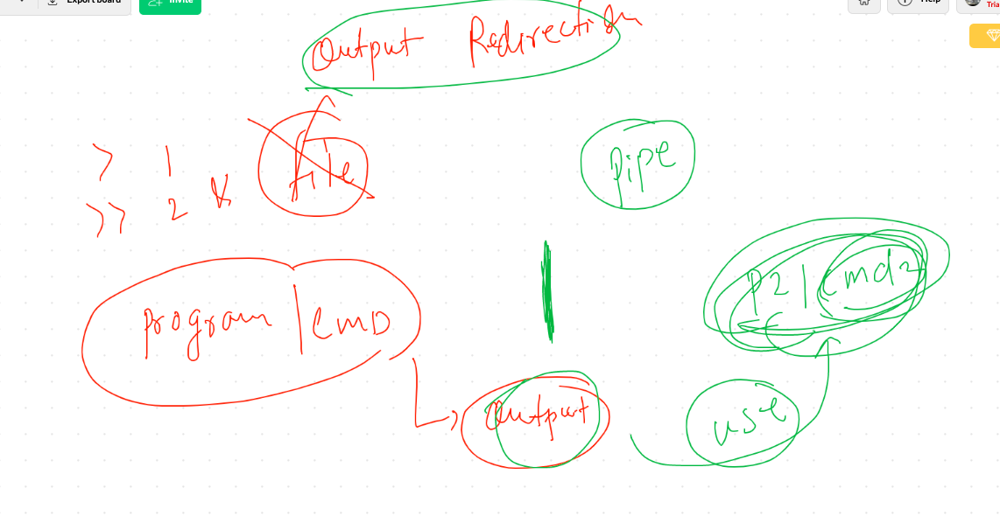
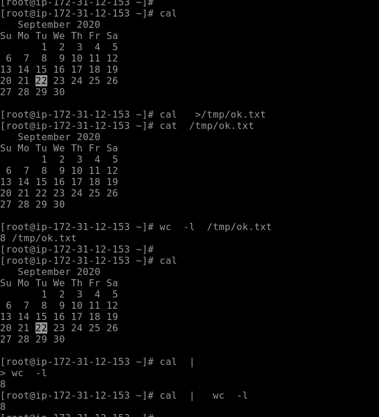
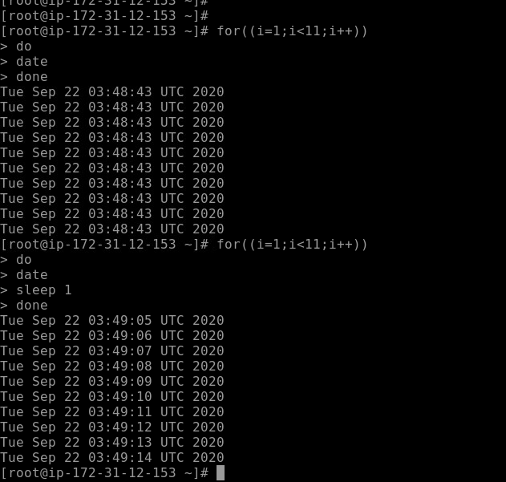
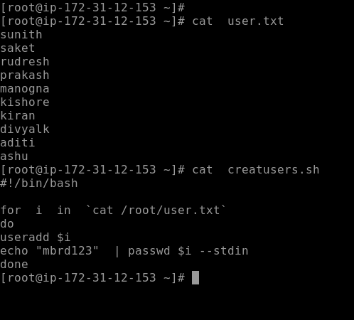

# user Management in Linux 

## to manage users we need root access 

## working in centos / rhel / fedora

### creating user 

## Login concept to users

## login with su reality

## settting password to users by root account

## Understanding pipe concept

## understanding demo of pipe

## understanding for / while loop with example

## creating users using for loop

