# Web Server

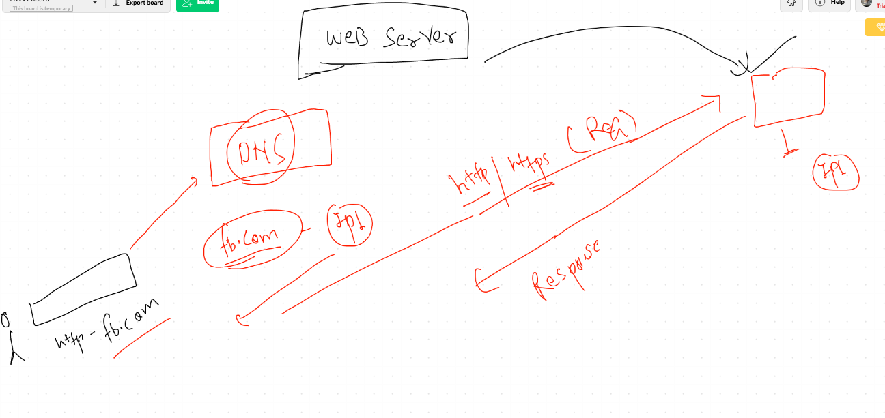

## selecting the right web server

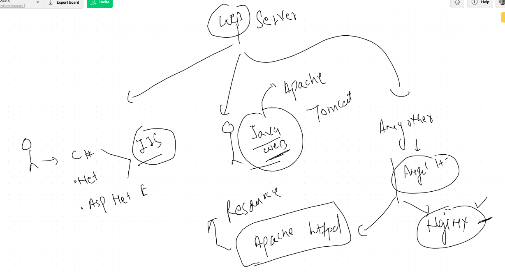

## check and install apache httpd


## checking changes by httpd


### check all changes

```
rpm -ql httpd

```

## configure page and start service of httpd

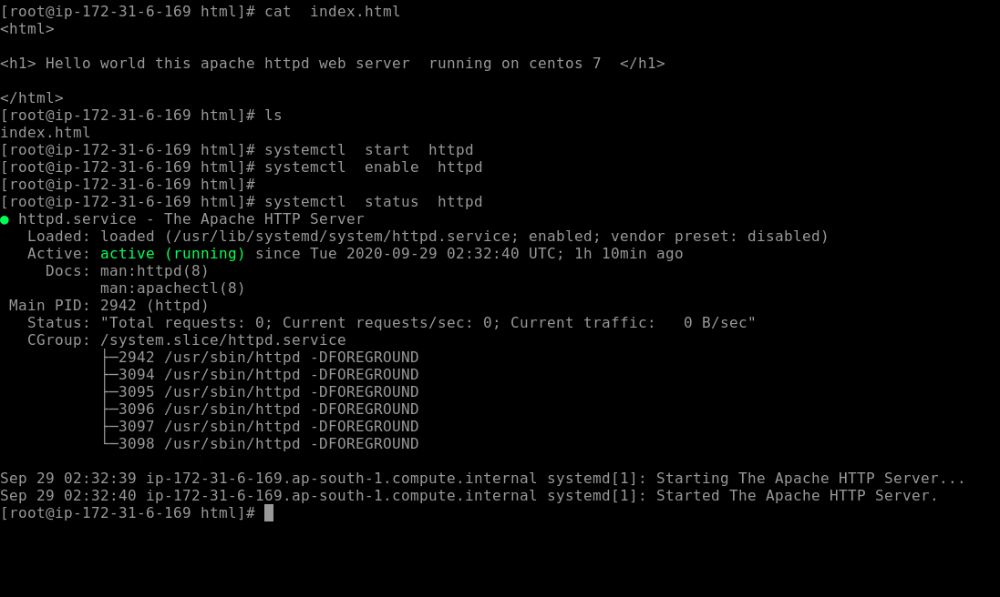

## Modules list checking in httpd

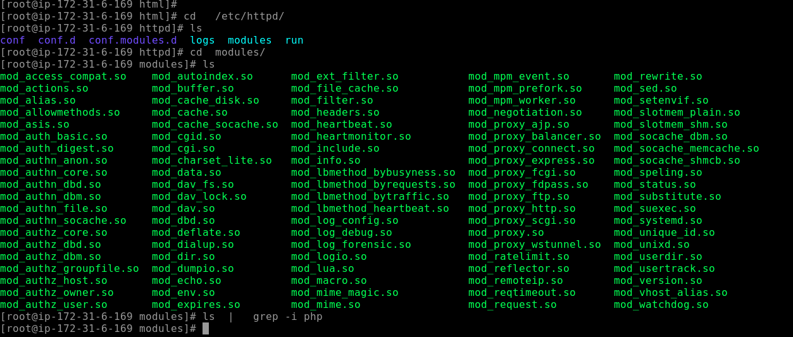

## installing php and restarting. web server

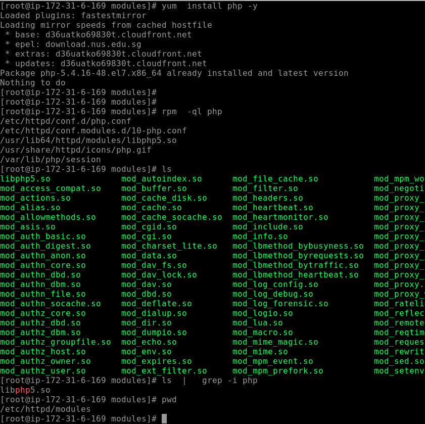

## disable selinux and change port 

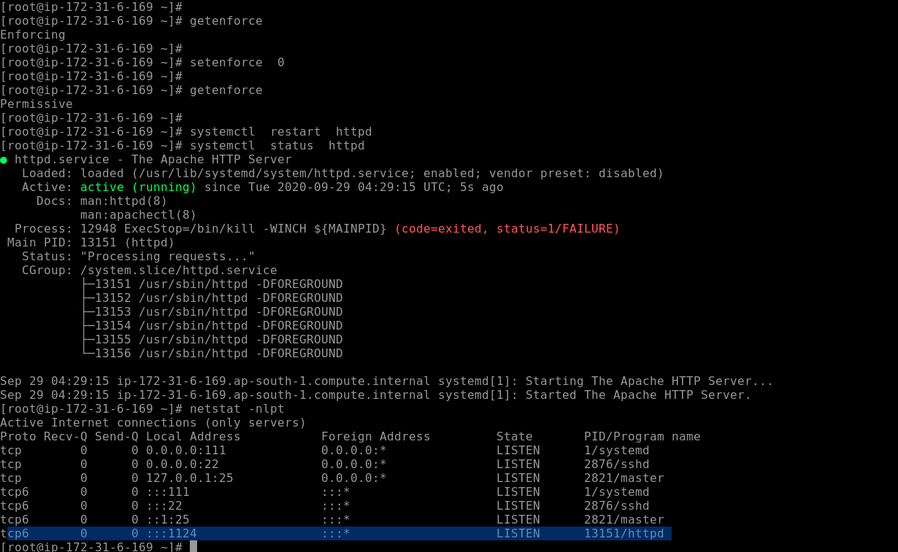


## adding. port in selinux policy 

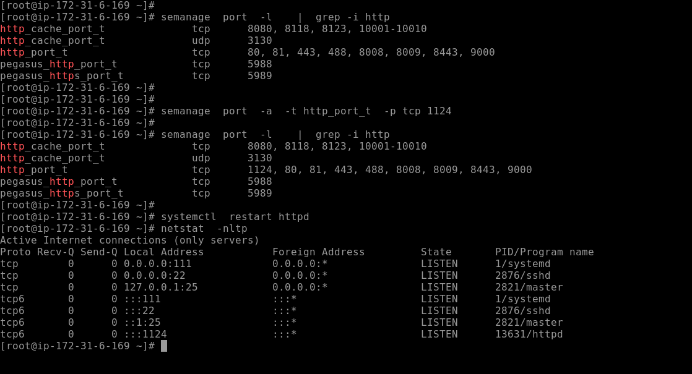


# Troubleshooting  

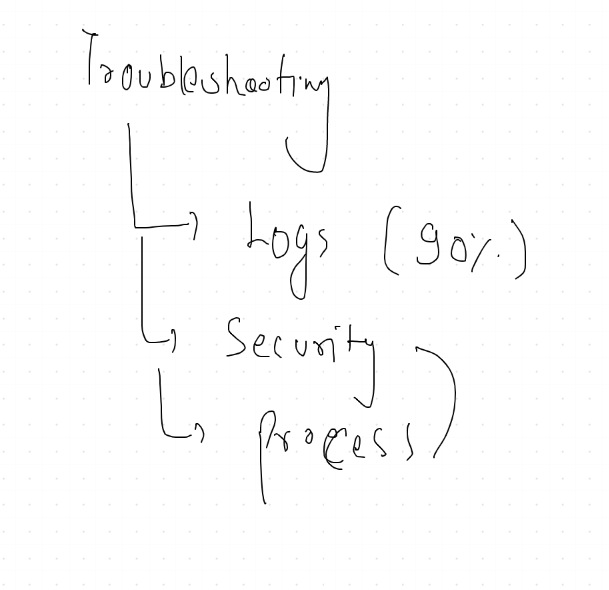

# Logs in OS 

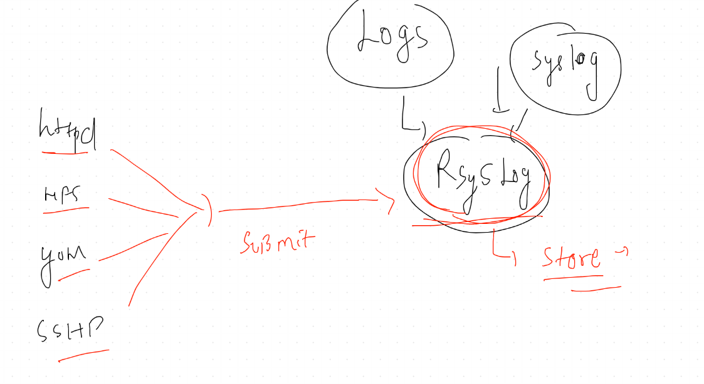

## rsyslog checking 

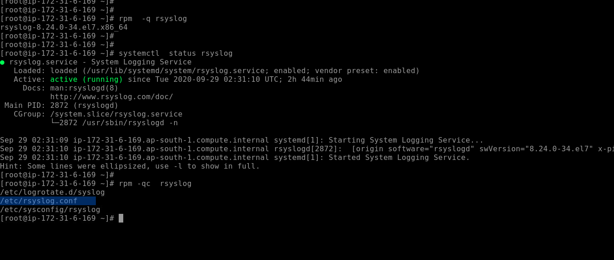

# Remote authentication with LDAP 

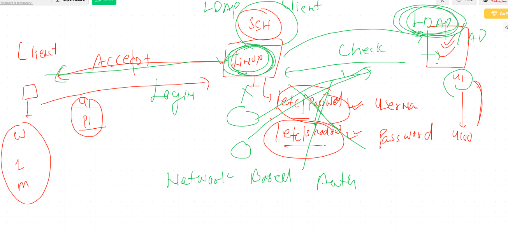

## More on remote auth and LDAP 

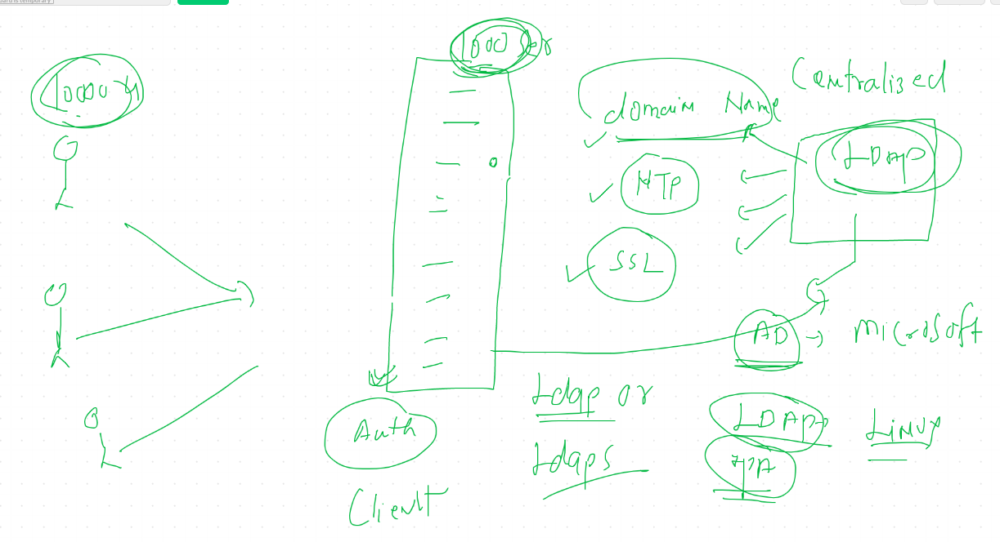
