# user Management in Linux 


## to manage users we need root access 


## working in centos / rhel / fedora

### creating user 


## Login concept to users


## login with su reality


## settting password to users by root account


## Understanding pipe concept


## understanding demo of pipe


## deleting user

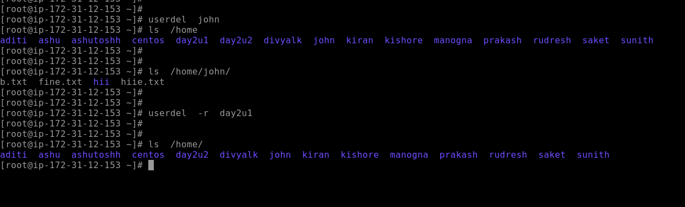

## understanding for / while loop with example


## creating users using for loop


## opensuse useradd 

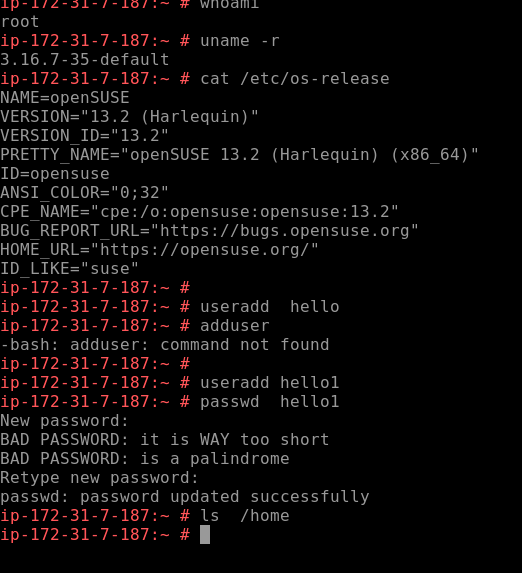

## adding users in open suse

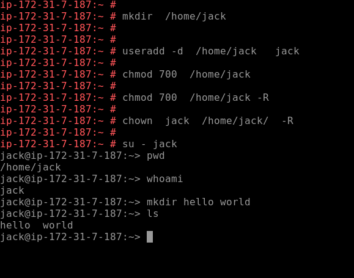


# LInux File system security 

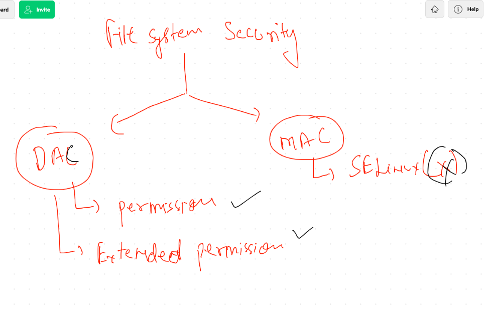

## checking permissions

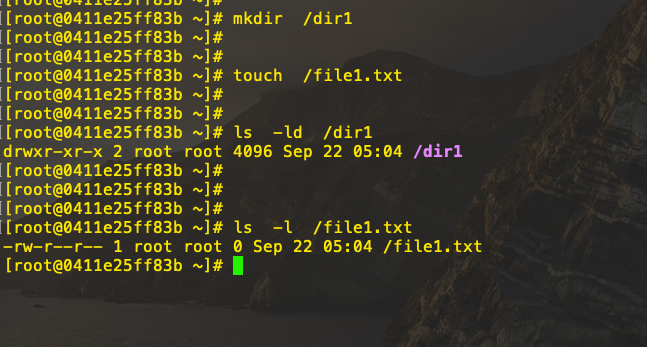

## advanced permission setup

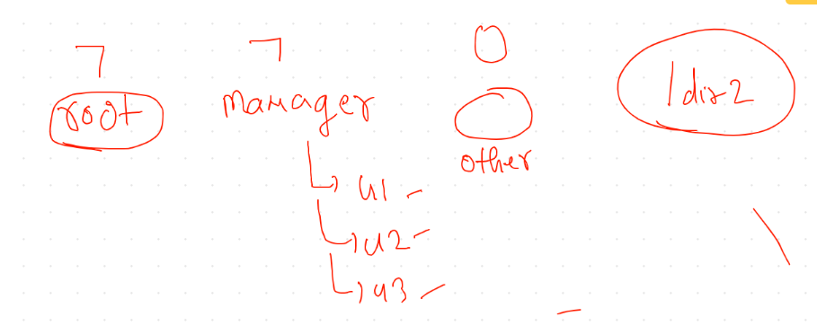

## sticky bit permission 

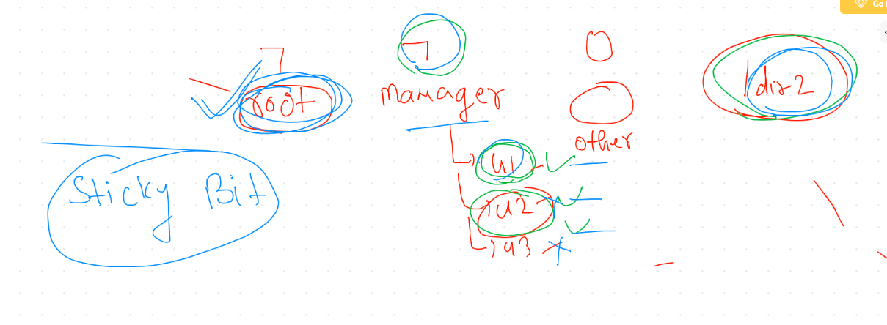

```
chmod +t /dir2

```

## SGID 

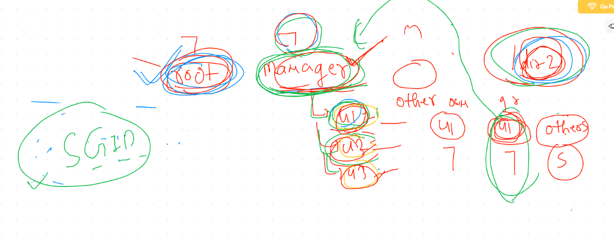

### implementing 

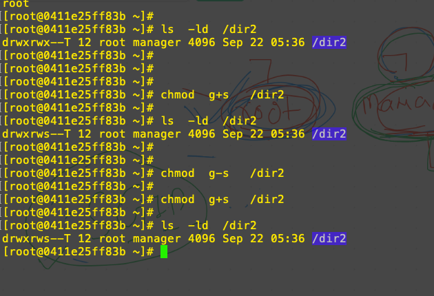

## stickybit and sgid using number 

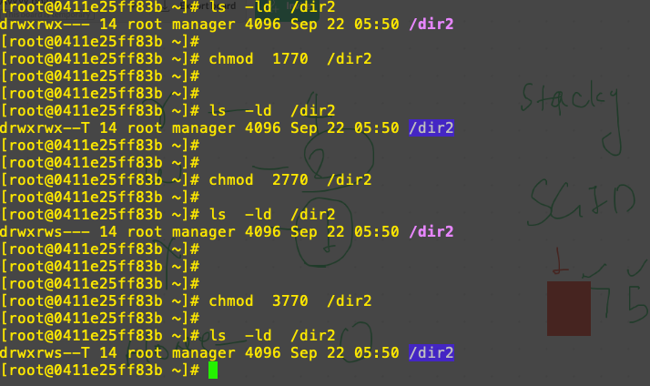

## Suid concept 

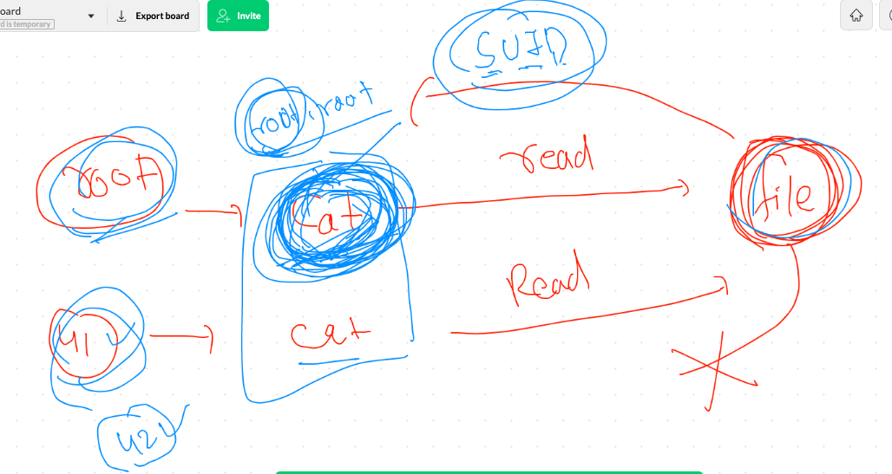

## suid implementation 

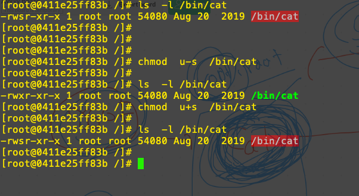
