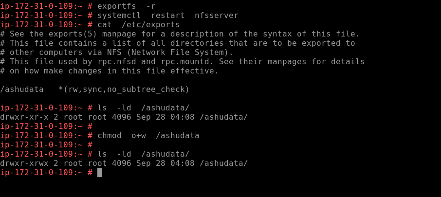
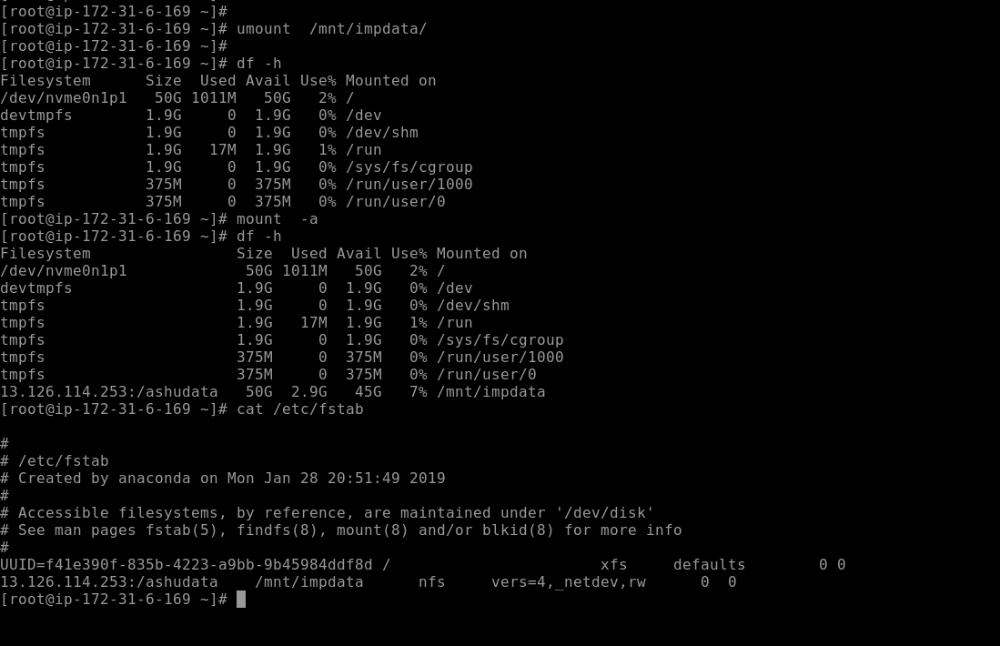
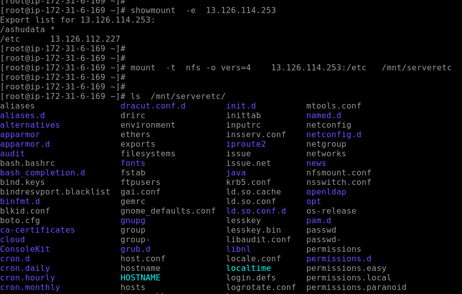
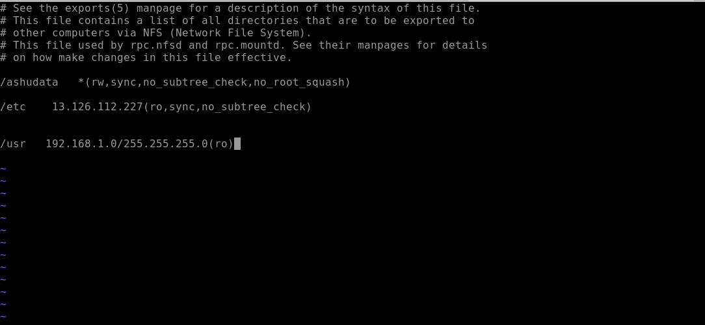

# SSH overview again 


## Security of SSH 

### port security 

<b> you can change default port number with selinux rule that we have already seen </b>

###  disable root access 


## denyusers in ssh 


# storage sharing understanding 


## NFS with RPC 


## NFS server. install 


## nfs server configure


## loading nfs configuration and starting service


## nfs client installation and check on opensuse


## nfs client installation and check on centos


## nfs mount on client machine 


## allow write operation to clients on server side



## nfs client persistent mount 



##  another mounting 




## Server configuration updates




# NFS server On centos 7

##  Install software 

```
yum install nfs-utils -y
```

## configuration file is same as opensuse 

```
cat /etc/exports 

```

## starting. nfs service

```
systemctl start nfs-server
systemctl enable nfs-server

```


