#  Understanding Centralized authentication method

## Remote auth check

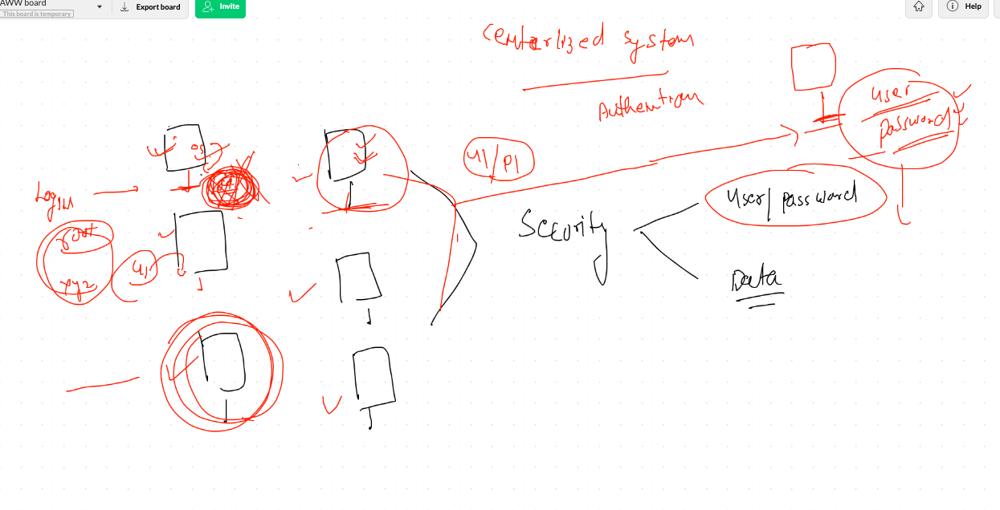

## LDAP 

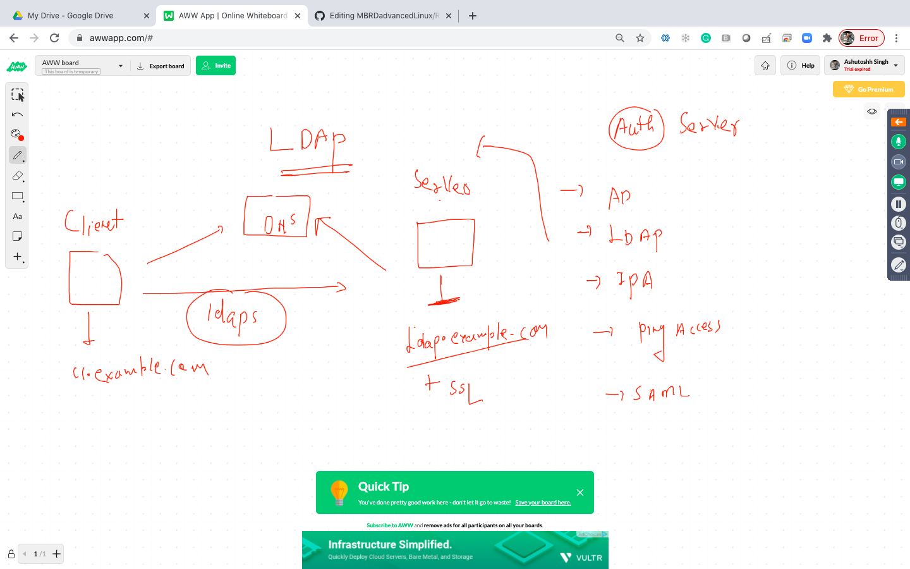

## Installing ldap client

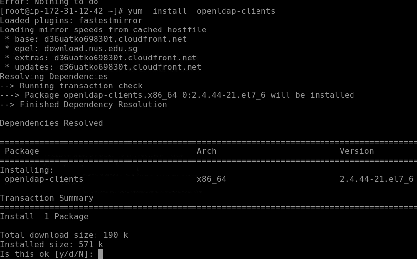

## Installing pam support

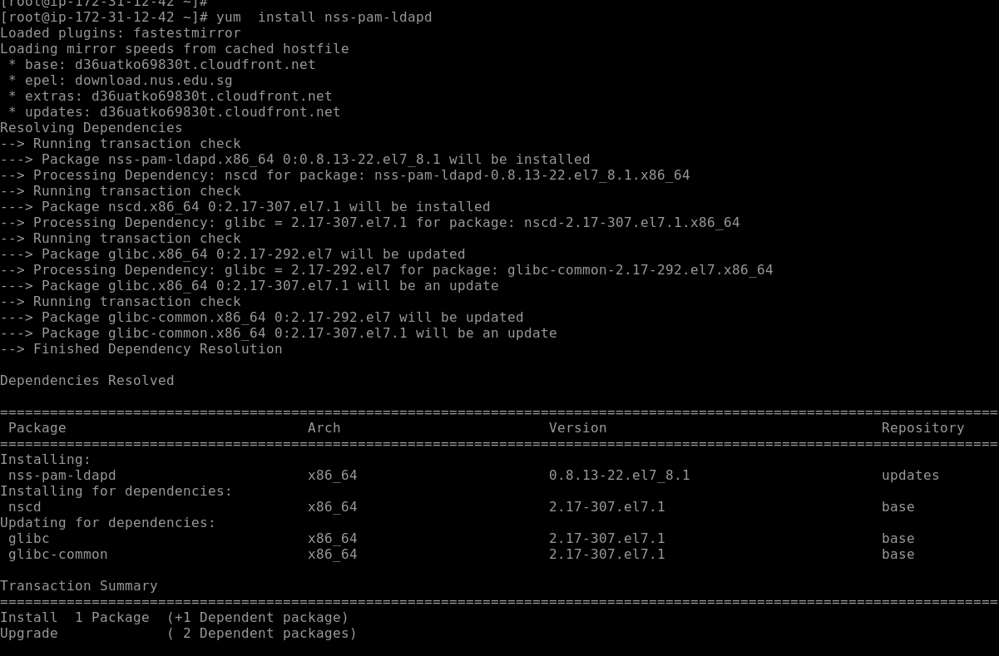

## command to configure ldap client

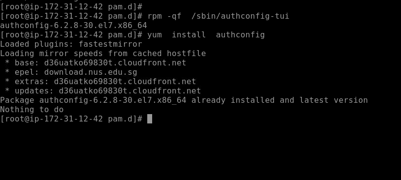

## Configuring ldap client

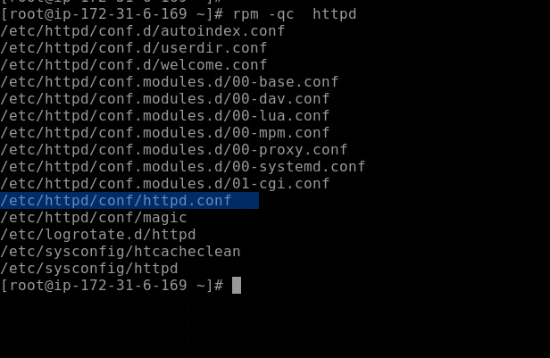

## client backend file

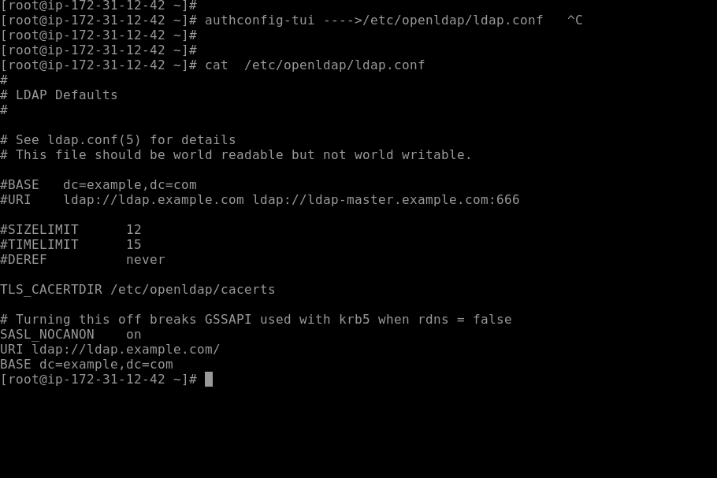

# Advanced storage  in LInux

## Understanding type of partition tables

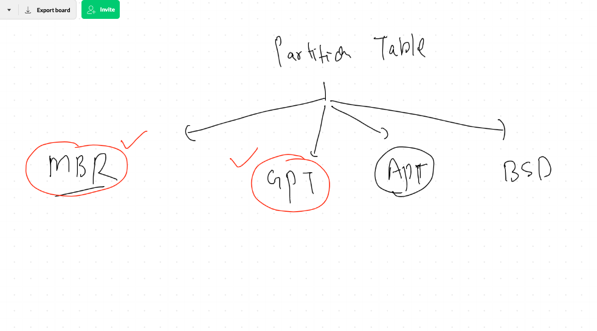

## MBR done

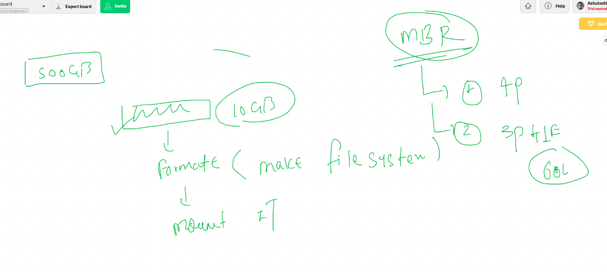

# GPT 

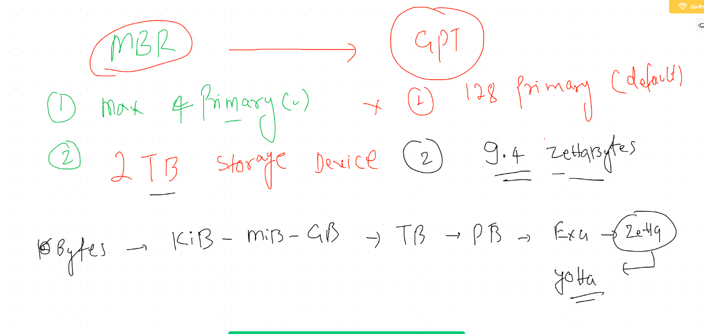

## understanding size of partition 

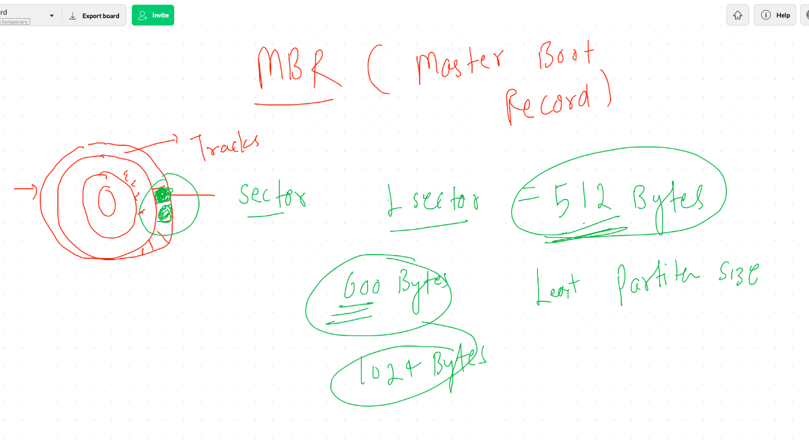

## Understanding MBR

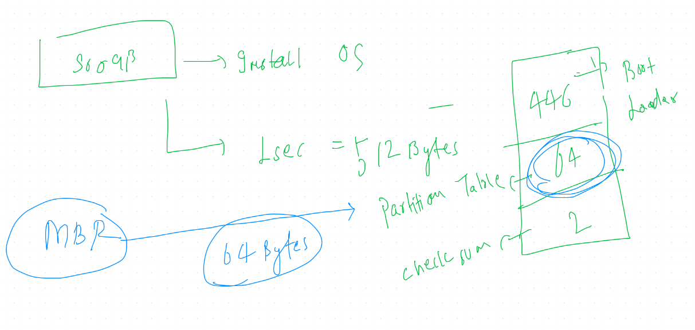

## creating primary partitions only in MBR

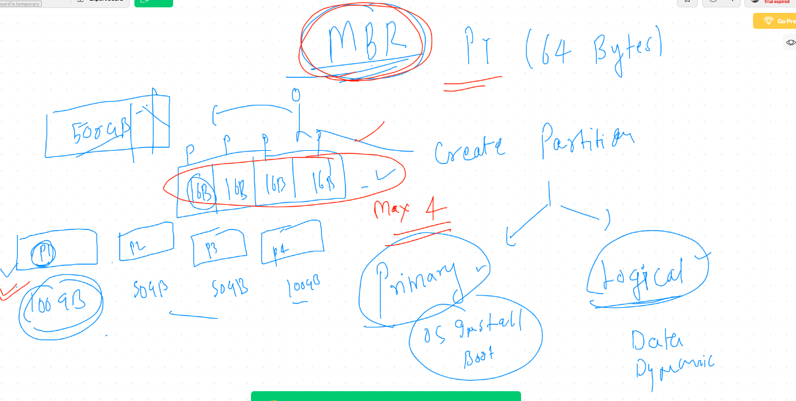

## more on MBR

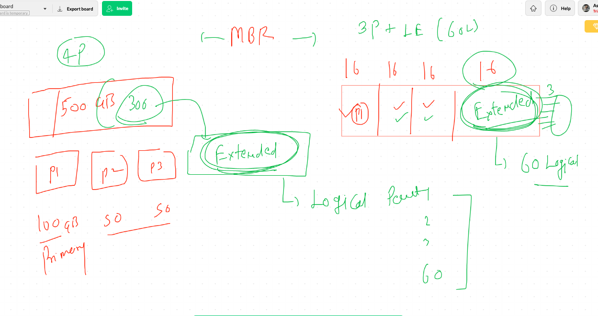

====

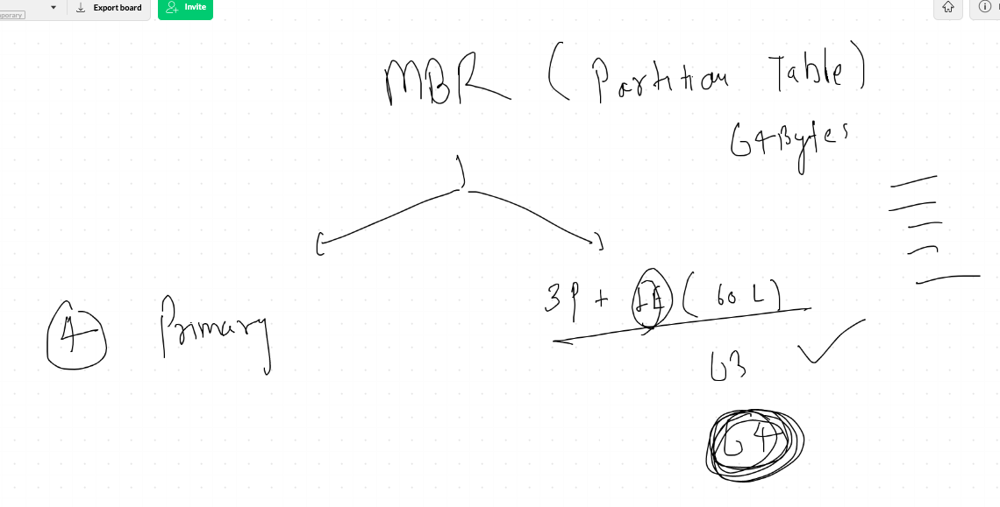

# Creating partition using fdisk in MBR format 

## checking all connected hard disks 

## creating partition 

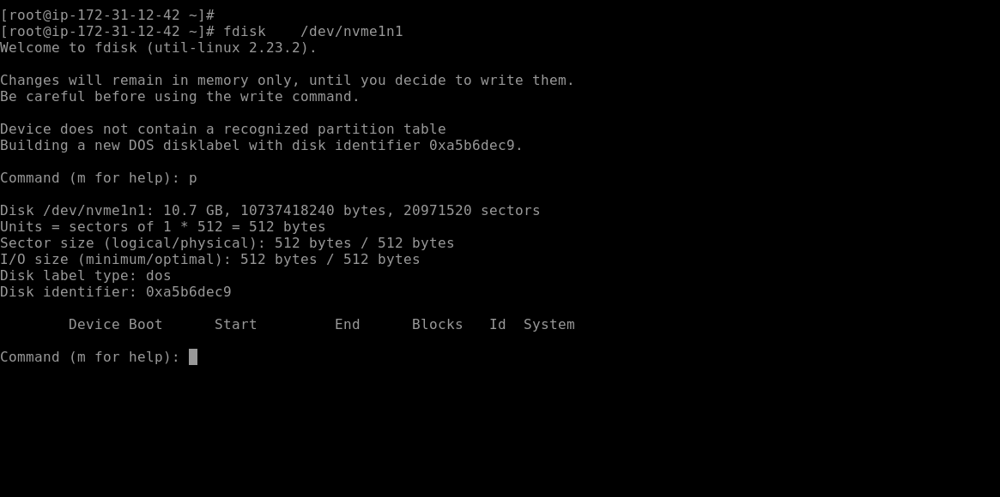

====

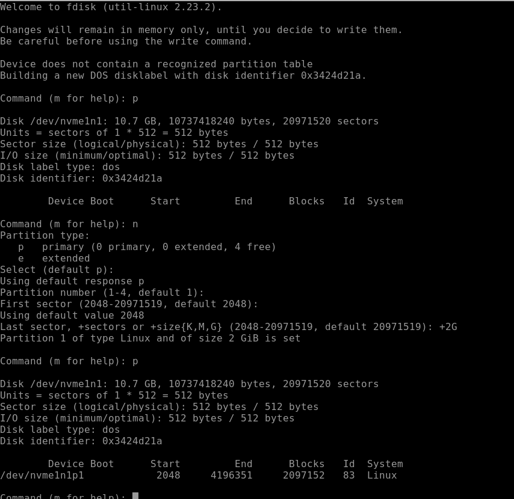

# creating and saving first MBR partition 

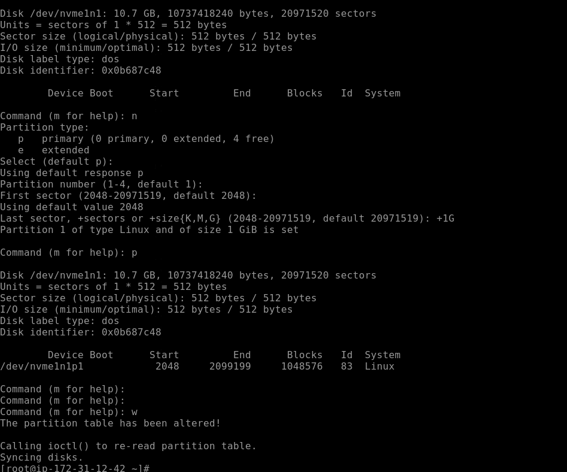

## updating partition table concept and solution 

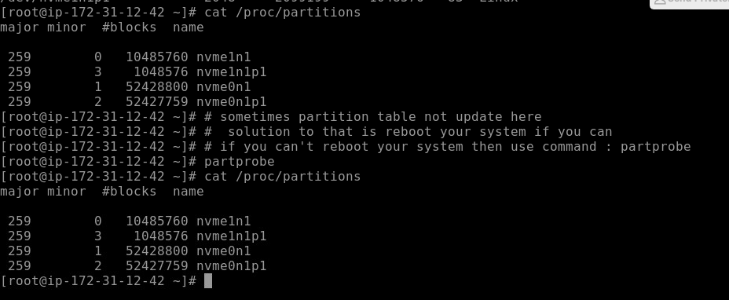

## 3 steps for store data in hard disk 

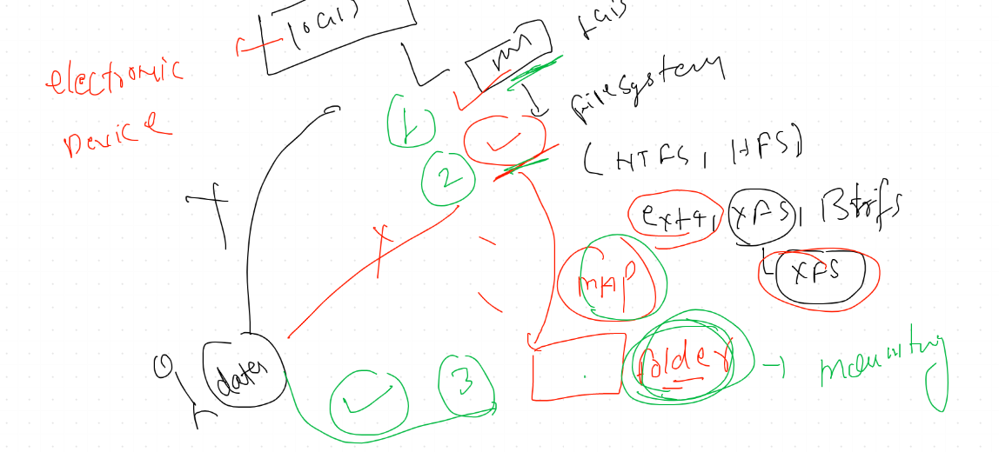

## final steps to format and mount partition 

