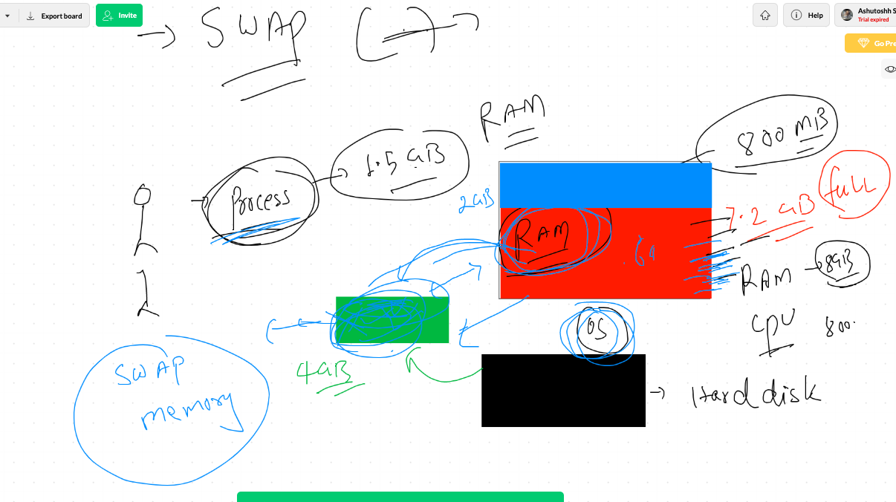
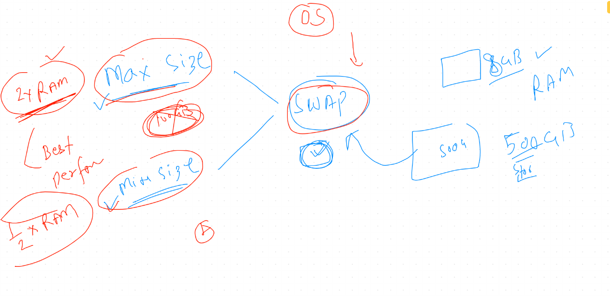
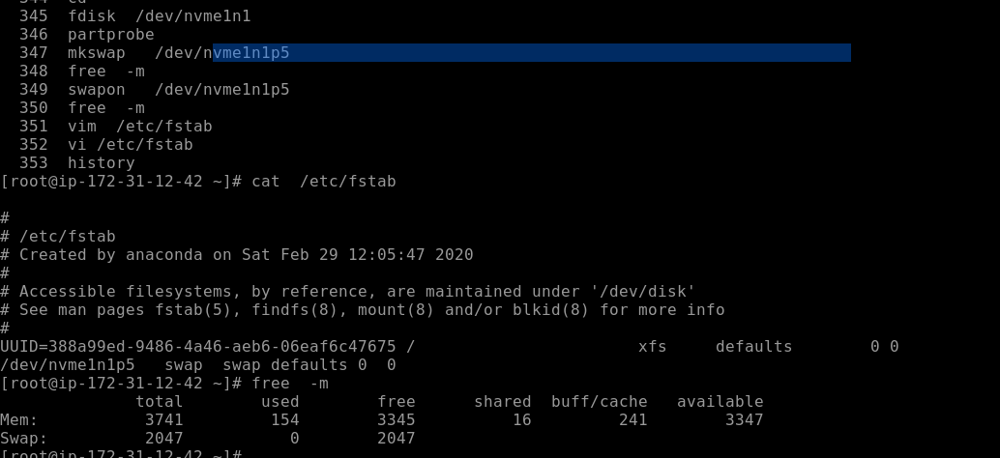
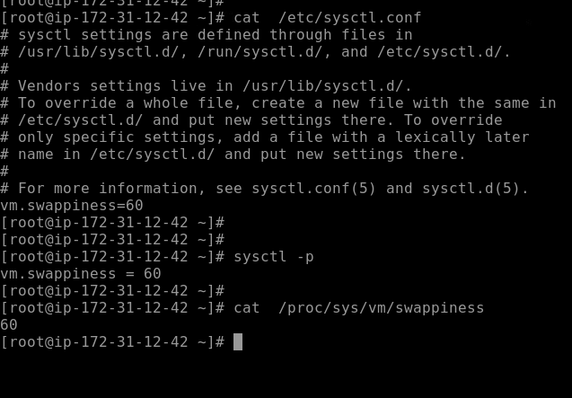

# Advanced Linux final day topics

<ol>
  <li> symbolic links </li>
  <li> examples of sed , awk , cut in shell scripting </li>
  <li> limits of users </li>
  <li> swap memory </li>
  <li> LVM thin provision </li>
  <li> LVM snapshot </li>
  
</ol>

# LVM snapshot 

## understanding lvm again 

## creating a snapshot of existing lvm with data

## restoring data with LVM snapshot

## creating and understanding LVM thin provisioning 

# Swap memory concept 

## swap memory size concept 

## swap done

## setting value of swapiness

