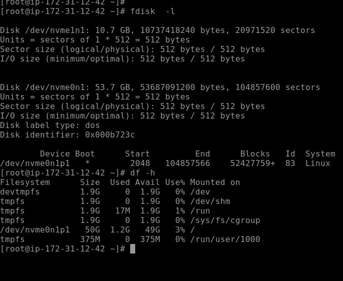
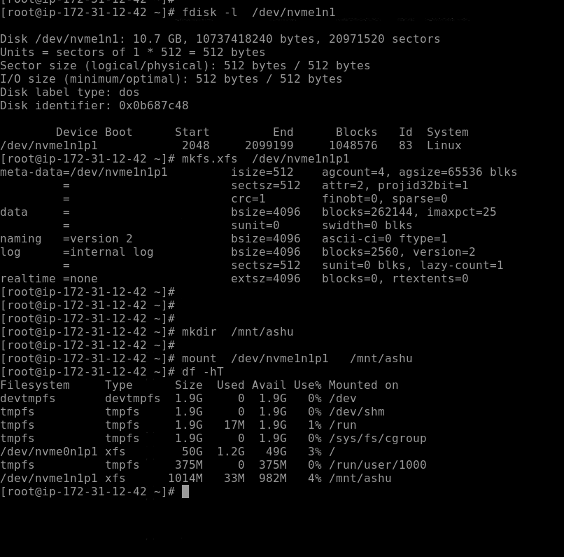

#  Understanding Centralized authentication method

## Remote auth check

## LDAP 

## Installing ldap client

## Installing pam support

## command to configure ldap client

## Configuring ldap client

## client backend file

# Advanced storage  in LInux

## Understanding type of partition tables

## MBR done

# GPT 

## understanding size of partition 

## Understanding MBR

## creating primary partitions only in MBR

## more on MBR

====

# Creating partition using fdisk in MBR format 

## checking all connected hard disks 

## creating partition 

====

# creating and saving first MBR partition 

## updating partition table concept and solution 

## 3 steps for store data in hard disk 

## final steps to format and mount partition 

