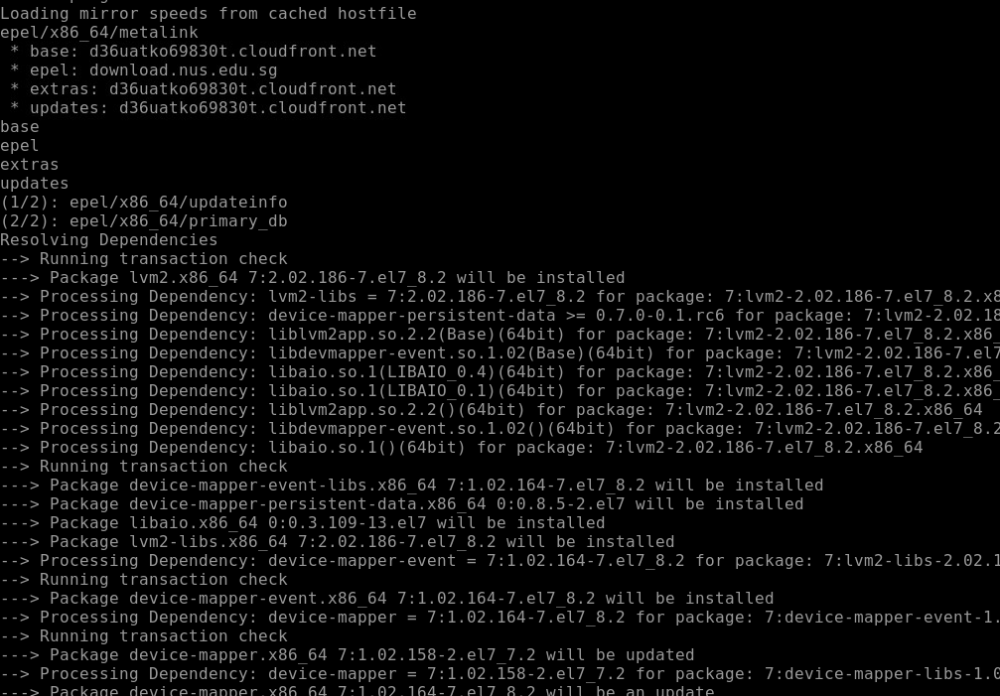

# Storage in Linux 

##  Object and block discussion 


## Story of partition table


## steps to partition a new raw hdd


# creating partition using GPT


## format and mount


# Device Mapper


## LVM concept 


## creating Physical volume 



---
----

## pv create


##  volume group create 


## creating logical volume from volume group


##  formating and mounting 


## LVM extending 


## lvm resizing 


----

## if XFS is the existing filesystem then 


## in case of EXt,2,3,4

```
resize2fs  path of LV 

```

## Extending volume group


