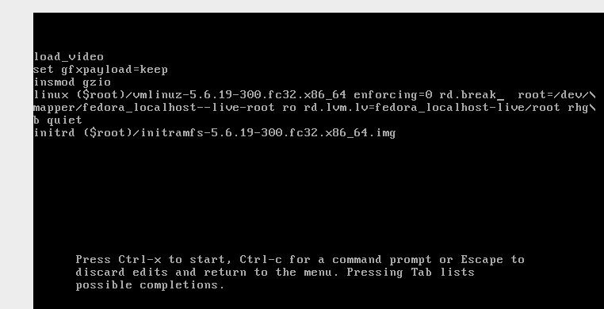

# Boot Process in Linux 

## boot with grub2 

## grub2 configuration file 

## loading file of grub.cfg 

## Regeneration of grub.cfg 

## generated grub.cfg 

# Root password breaking 

## step 1 reboot and select kernel 

## step 2  edit grub2 line to pass kernel parameter

## mount temp filesystem called sysroot 

##  make root password persistent

