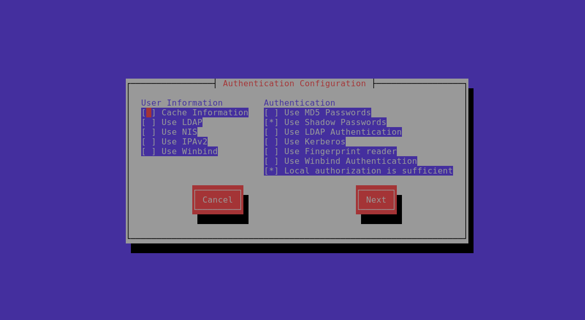

# Web Server


## selecting the right web server


## check and install apache httpd


## checking changes by httpd



### check all changes

```
rpm -ql httpd

```

## configure page and start service of httpd


## Modules list checking in httpd


## installing php and restarting. web server


## disable selinux and change port 


## adding. port in selinux policy 


# Troubleshooting  


# Logs in OS 


## rsyslog checking 


# Remote authentication with LDAP 


## More on remote auth and LDAP 


