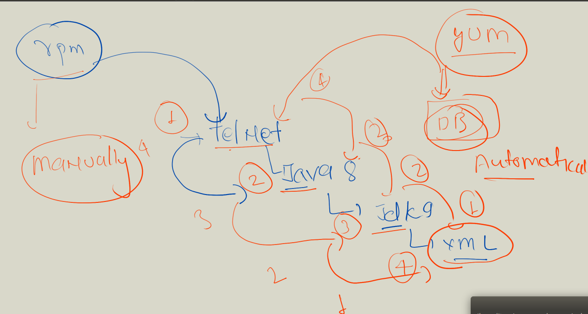

# Extended Linux Permission (ACL)

# Access controll list 


## setting acl to a directory 


## listing acl 


## adding group in acl 


## remove entire acl and particular user

```
setfacl -x u:u6  /project
```


# package Management  in Linux 


## type of package


## check package status 


## after rpm installation what changes made in system 


## List of all installed software / package in centos 


# managing package install with YUM 


## installing using yum


## query to a package 


## install using rpm


# YUM and rpm explained


## YUm and rpm internal working 




## advanced list of package management system 


## checking history of yum 


##  yum undo with dependency


