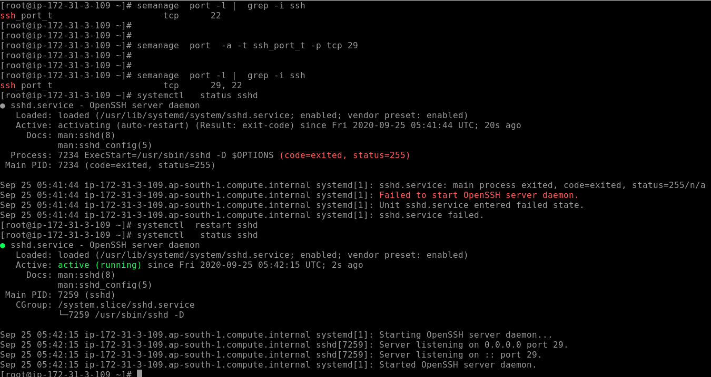

# Boot Process in Linux 

## boot with grub2 

## grub2 configuration file 

## loading file of grub.cfg 

## Regeneration of grub.cfg 

## generated grub.cfg 

# Root password breaking 

## step 1 reboot and select kernel 

## step 2  edit grub2 line to pass kernel parameter

## mount temp filesystem called sysroot 

##  make root password persistent

# Networkin 

## checking arp and routing table

# REMote login in LInux 

## History and understanding 

## SSH protocol

## Install / check ssh server and its changes 

## starting sshd service

## ssh public / private keygen and transfer to server account 

## changing port number  with selinux enabled

## connecting from client after changing port number

