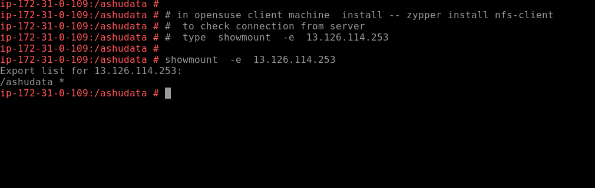

# SSH overview again 

## Security of SSH 

### port security 

<b> you can change default port number with selinux rule that we have already seen </b>

###  disable root access 

## denyusers in ssh 

# storage sharing understanding 

## NFS with RPC 

## NFS server. install 

## nfs server configure

## loading nfs configuration and starting service

## nfs client installation and check on opensuse

## nfs client installation and check on centos

## nfs mount on client machine 

